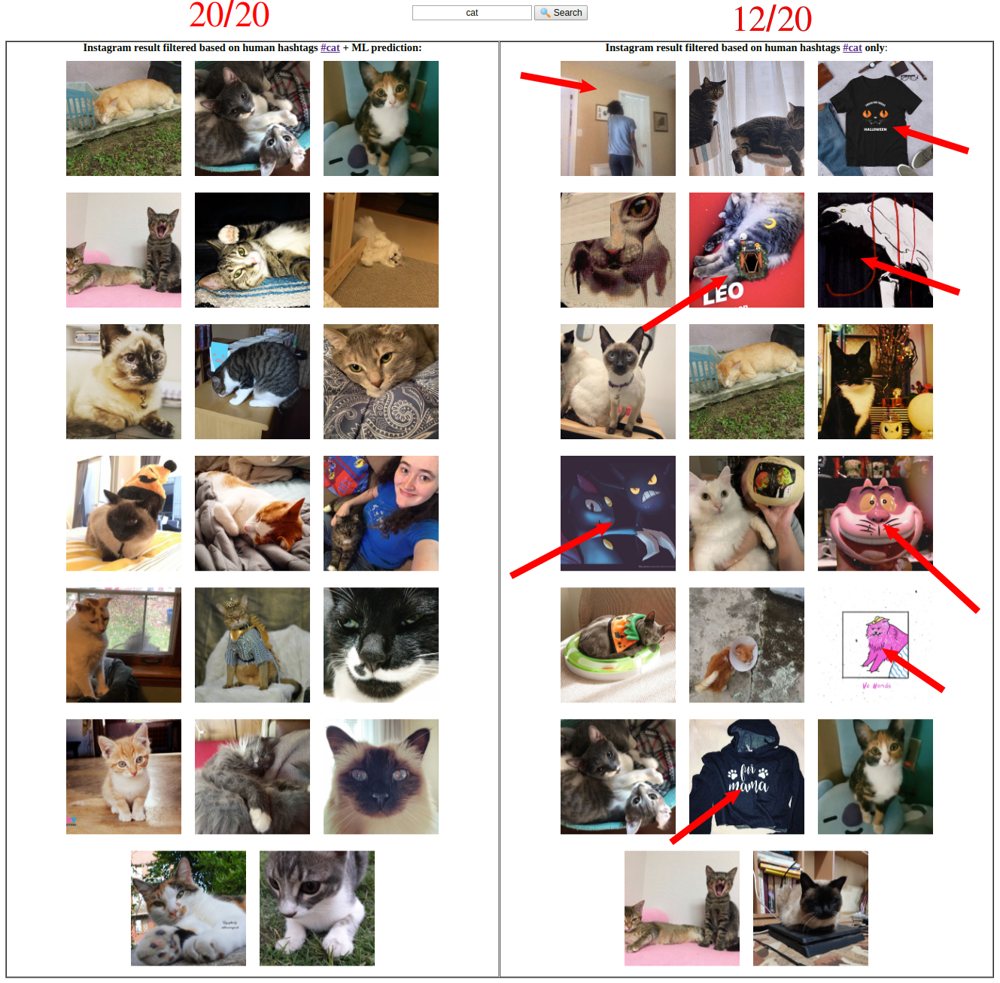

# instagrammer

[](LICENSE)
[](https://www.npmjs.com/package/ml-image-searcher)

NodeJS module NPM package that helps to search for images using instagram hashtags and machine learning object recognition technology.

## Disclamer

Instagram has gone to great lengths to prevent scraping and other unauthorized access to their public content. This module is dependant on the markup the public-facing instagram.com. Should that change this module might also stop working as intended. You should take this into consideration when deciding whether this module will work for you.

## Motivation

In example below it shows how searching using:<br>

- human hashtags + ML: 20(cats) / 20(total result) -> [100% correct]<br>
- human hashtags : 12(cats) / 20(total result) -> [60% correct]

## Installation

`npm i ml-image-searcher`

## Usage

note: there are some limitation of loading instagram data, but it still usefull in most cases :)

### Search for cats photos using human hashtags + machine learning prediction

```
const IG = require('ml-image-searcher');

IG.getImages('cat').then((ret) => console.log(ret.filteredData))

```

#### Output (format: `htmlAll`) response:



#### Output (format: `filteredData`) response:

```json
{ "node":
     { "comments_disabled": false,
       "__typename": "GraphImage",
       "id": "2166483334784860896",
       "edge_media_to_caption": "[Object]",
       "shortcode": "B4Q5R1Np8Lg",
       "edge_media_to_comment": "[Object]",
       "taken_at_timestamp": 1572484960,
       "dimensions": "[Object]",
       "display_url":
        "https://instagram.fatz1-1.fna.fbcdn.net/vp/a7d0f86a15a5d4830f08263741c057ec/5E3E0F4B/t51.2885-15/e35/76909697_2616077041746584_1323244633407869990_n.jpg?_nc_ht=instagram.fatz1-1.fna.fbcdn.net&_nc_cat=108",
       "edge_liked_by": "[Object]",
       "edge_media_preview_like": "[Object]",
       "owner": "[Object]",
       "thumbnail_src":
        "https://instagram.fatz1-1.fna.fbcdn.net/vp/620528b4197d036abda248ccbe36697e/5E61A8F1/t51.2885-15/sh0.08/e35/s640x640/76909697_2616077041746584_1323244633407869990_n.jpg?_nc_ht=instagram.fatz1-1.fna.fbcdn.net&_nc_cat=108",
       "thumbnail_resources": "[Array]",
       "is_video": false,
       "accessibility_caption": "Image may contain: cat" } },
  { "node":
     { "comments_disabled": false,
       "__typename": "GraphImage",
       "id": "2166483275533936833",
       "edge_media_to_caption": "[Object]",
       "shortcode": "B4Q5Q-CBmjB",
       "edge_media_to_comment": "[Object]",
       "taken_at_timestamp": 1572484953,
       "dimensions": "[Object]",
       "display_url":
        "https://instagram.fatz1-1.fna.fbcdn.net/vp/bd226ff8cf673943e32aa28696a9e66e/5E64A3DA/t51.2885-15/e35/73284628_148613809747256_665998994713792293_n.jpg?_nc_ht=instagram.fatz1-1.fna.fbcdn.net&_nc_cat=108",
       "edge_liked_by": "[Object]",
       "edge_media_preview_like": "[Object]",
       "owner": "[Object]",
       "thumbnail_src":
        "https://instagram.fatz1-1.fna.fbcdn.net/vp/3ff84475c7f81dc9c1e75d6524609b65/5E48B2A9/t51.2885-15/sh0.08/e35/s640x640/73284628_148613809747256_665998994713792293_n.jpg?_nc_ht=instagram.fatz1-1.fna.fbcdn.net&_nc_cat=108",
       "thumbnail_resources": "[Array]",
       "is_video": false,
       "accessibility_caption": "Image may contain: cat" } },
  ...
}
```

---

## Run Locally:

1. clone this repo
2. cd ml-image-searcher/
3. change LISTENER variable in .env file to: `LISTENER='true'`
4. run `node index.js`
5. open browser: localhost:8080

## Response formats:

```
{
    originalData,      // result based on humans hashtags only
    filteredData,      // result based on humans hashtags and ML prediction
    htmlOriginalData,  // originalData images only in html format
    htmlFilteredData,  // filteredData images only in html format
    htmlAll,           // both results (htmlOriginalData + htmlFilteredData) in a table
};
```
